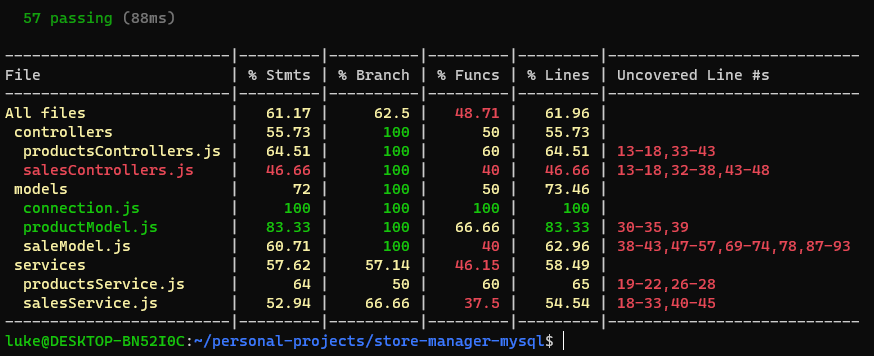
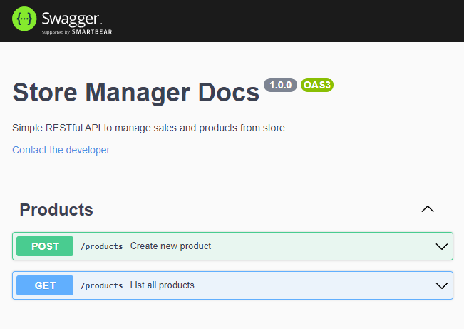

# **Boas-vindas ao repositório do Projeto Store Manager!**

A API desenvolvida é um sistema de gerenciamento de vendas em que é possível criar, visualizar, deletar e atualizar produtos e vendas.

Foi utilizado o banco MySQL para a gestão de dados. Além disso, a API foi construída utilizando a arquitetura MSC (model-service-controller) e seguindo padrões RESTful.

A aplicação possui 60% de cobertura de testes.

### **_Atenção_**: utilize docker-compose para rodar a aplicação.

## _Documentação: em progresso..._

- [x] POST /products route.
- [x] GET /products route.
- [ ] GET /products/:id route.
- [ ] UPDATE /products/:id route.
- [ ] DELETE /products/:id route.
- [ ] POST /sales route.
- [ ] GET /sales route.
- [ ] GET /sales/:id route.
- [ ] UPDATE /sales/:id route.
- [ ] DELETE /sales/:id route.
