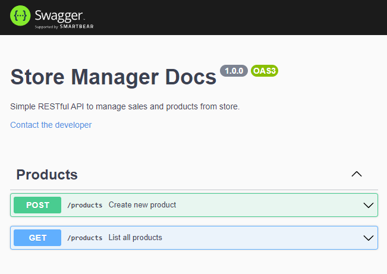

<h1 align="center"><strong>Welcome to Store Manager's repository!</strong></h1>

[pt-br README](README-pt.MD)

<h2 align="center">
  
  
  
  
  
  
</h2>

### Project Description:

This is an RESTful API that manages sales. It's possible to create, visualize, delete and update sales and products.

It uses MySQL to manage and store data, and follows REST principles. It was developed using MSC (model-service-controller) architeture.

The application has 60% test coverage.

### **_WARNING_**: please, use docker-compose to run the application.

---

### :construction: _Documentation in progress..._ :construction:

### Documented routes:

- [x] POST /products route.
- [x] GET /products route.
- [ ] GET /products/:id route.
- [ ] UPDATE /products/:id route.
- [ ] DELETE /products/:id route.
- [ ] POST /sales route.
- [ ] GET /sales route.
- [ ] GET /sales/:id route.
- [ ] UPDATE /sales/:id route.
- [ ] DELETE /sales/:id route.
